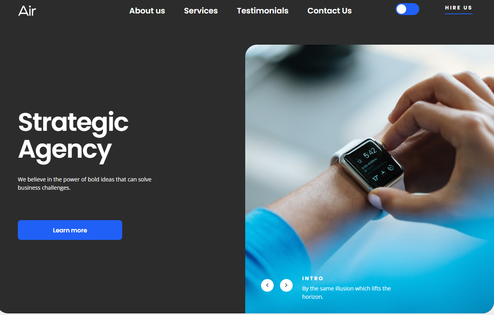

# Air Landing Page

[Live Demo](https://razor5000.github.io/air-landing/)

## 📋 Описание проекта
Адаптивный лендинг для национального художественного музея украины. В проекте реализована верстка по макету Figma, использованы современные подходы к стилизации и сборке.

## 🛠 Технологии
* **HTML5 / SCSS** (БЭМ методология)
* **Vite** (сборка проекта)
* **Cypress** (тестирование)
* **GitHub Pages** (хостинг)

## 🚀 Как запустить локально
1. Клонировать репозиторий:
   `git clone https://github.com/razor5000/air-landing.git`
2. Установить зависимости:
   `npm install`
3. Запустить режим разработки:
   `npm run dev`
